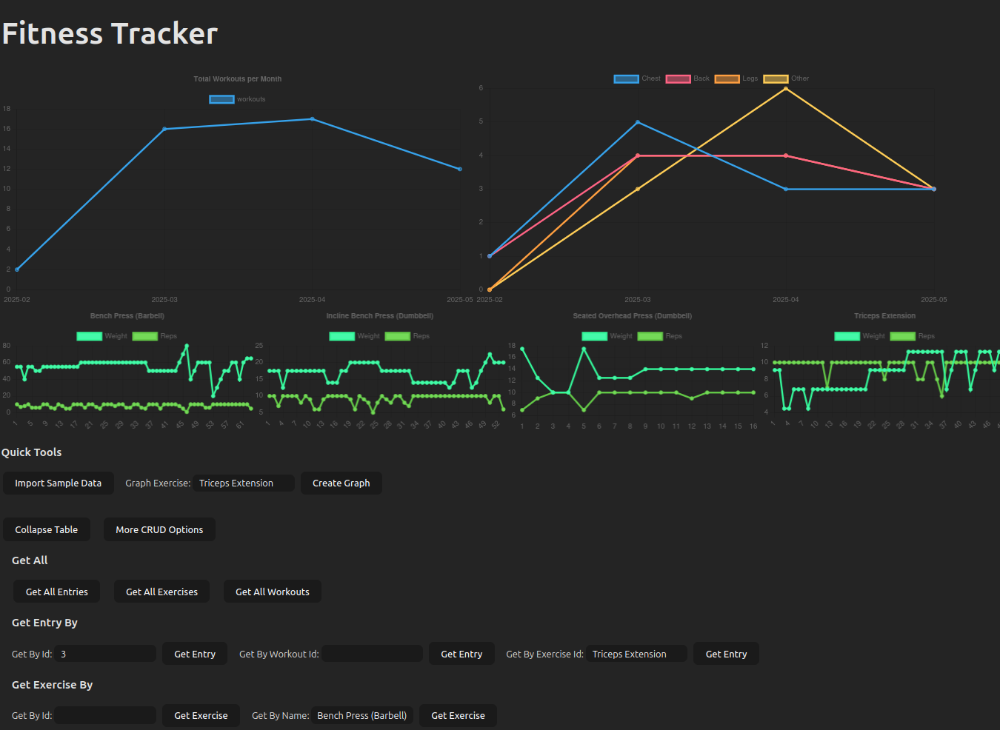

# **Fitness Tracker Frontend**



The Backend Repo: https://github.com/AbishakeSrithar/fitness-tracker-backend

## Motivation
The idea of this project was to make a basic CRUD Application from scratch that connects Frontend/Backend using some of the tools I wanted to learn more about:
- Frontend
  - Typescript
  - Vite
  - HTML
  - CSS
  - Chartjs

- Backend
  - Kotlin
  - Springboot
  - Flyway
  - PostgreSQL
  - Docker
  - Shell Scripts

I chose a Fitness Tracker because my current app charges money to Graph my lifts and I thought it would be fun to try do that myself. 

The CSV converter part to load sample data is not designed generically and is specifically for my exported data. Assumptions such as 1 workout per day max and workout split names containing chest/push, back/pull, legs/lower are all hardcoded based on my data.

## Start Up
Run these commands
``` shell
npm i
npm run dev
```

Click Import Sample Data and wait until workout frequency graph appears. This is roughly 3 months of my own Workout Data exported from the "Strong" App I use.
Can click More CRUD options -> Get All Exercises to see names of exercises I've done, input that name into the Graph Exercise input field and hit button to see individual progression graphs

The More CRUD options button give you the buttons to Create, Read, Update and Delete (Entries, Workouts and Exercises). Can do this with the sample data or start afresh.
The Collapse Table button will just destroy whatever the current table is that's being displayed (should only be 1 max at any time). This was added because my sample data has 1800+ entries xD
